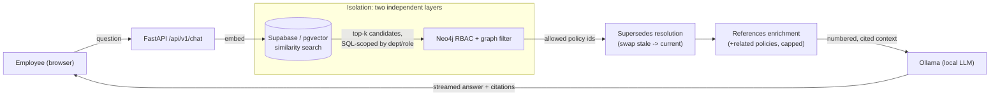

# MHN Policy Assistant

[](https://github.com/nilsndev/company_policy_chatbot/actions/workflows/ci.yml)

Personal full-stack RAG + graph chatbot for a fictional company, **Meridian Health Network (MHN)**: employees sign in, ask grounded questions about company policy, and get cited answers scoped to what their role/department is allowed to see.

See [`PRD.md`](PRD.md) for the company profile, personas, and requirements; [`PROGRESS.md`](PROGRESS.md) for milestone status; [`CLAUDE.md`](CLAUDE.md) for stack and project rules.

## Why this exists

Plain vector search over a policy corpus has two blind spots: it can't enforce who's allowed to see what, and it can't represent that policies supersede and reference each other. This project pairs **Supabase/pgvector** (semantic recall) with **Neo4j** (a graph that's *both* the RBAC layer and the policy-relationship layer) to fix both, and it's measured, not asserted — see [Evaluation](#evaluation) below.

## Architecture



Chunks only reach the LLM if **both** the SQL-level department/role filter and the independent Neo4j graph traversal allow them — see `app/services/retrieval.py` and the `graph` skill. Everything runs as native processes locally (no Docker — see [Local development](#local-development)); Supabase and Neo4j are hosted free-tier cloud instances even in dev.

## Stack

| Layer | Choice |
| --- | --- |
| API | FastAPI, SSE for chat tokens |
| UI | React + TypeScript (Vite, TanStack Query) |
| Relational / auth / files / vectors | Supabase Cloud (hosted free tier) |
| Graph | Neo4j Aura Free — RBAC graph **and** GraphRAG (policy supersedes/references) |
| Jobs | A second native worker process draining the ingestion queue |
| LLM + embeddings | Ollama, native local install |

Full rationale and rules: [`CLAUDE.md`](CLAUDE.md).

## Local development

No Docker (unsupported on this dev machine's network — see `.claude/skills/local-dev/SKILL.md`). Everything runs as a native process against hosted Supabase Cloud + Neo4j Aura Free dev instances.

1. Copy `.env.example` → `.env` and `frontend/.env.example` → `frontend/.env`; fill in your Supabase/Neo4j/Ollama values (never commit either file).
2. `ollama pull <chat model>` and `ollama pull <embedding model>` (whatever you set as `OLLAMA_CHAT_MODEL` / `OLLAMA_EMBED_MODEL`).
3. Backend:
   ```
   python -m venv .venv && .venv\Scripts\activate
   pip install -r requirements.txt
   python scripts/migrate.py     # applies supabase/migrations/*.sql via DATABASE_URL
   python scripts/seed_corpus.py # uploads corpus/policies/*.md to Storage + enqueues ingestion jobs
   python scripts/seed_graph.py  # writes Policy/Department nodes + APPLIES_TO/SUPERSEDES/REFERENCES edges to Neo4j
   python run.py                 # not `uvicorn app.main:app` directly — see PROGRESS.md M1 notes (Windows event loop)
   ```
4. Worker (separate terminal — drains the ingestion queue seeded above):
   ```
   .venv\Scripts\activate
   python worker.py
   ```
5. Frontend (separate terminal):
   ```
   cd frontend
   npm install
   npm run dev
   ```
6. Visit the Vite dev server URL, sign up (email/password + department/role), and chat. `/health` and `/ready` are on the API for liveness/readiness checks; `GET /api/v1/policies` shows ingestion status per policy. Chat answers are grounded in hybrid vector+graph retrieval with inline `[n]` citations, scoped server-side to the signed-in employee's department/role (`graph` skill, PRD §6.3/§6.5) — an IT employee never sees Clinical-only policy content, and vice versa, except company-wide policies.

### Running the eval

```
python scripts/eval_golden_set.py
```

Requires the 4 eval persona accounts to exist (see [Evaluation](#evaluation)) — sign them up once through the running app. Writes `eval/report.md`.

## Evaluation

[`eval/golden_set.json`](eval/golden_set.json) is a 24-case golden set across the PRD's 4 personas (Priya/Clinical, Marcus/IT & Security, Dana/Compliance & Risk, Sam/HR), covering in-scope questions, cross-department isolation, superseded-policy resolution, and cross-reference enrichment. [`scripts/eval_golden_set.py`](scripts/eval_golden_set.py) runs every case through the retrieval pipeline twice — a vector-only baseline (`use_graph=False`, the pipeline before the graph layer existed) and the current hybrid vector+graph pipeline — and reports the delta in [`eval/report.md`](eval/report.md), per the project rule that a retrieval improvement claim needs a measured eval, not an assertion.

Headline result: retrieval recall was **100% for both modes** on every category — the graph doesn't change whether the right chunk is found. Isolation is where they diverge: the vector-only baseline leaked cross-department or stale-version content in **6 of 6** cases designed to test it; the hybrid pipeline leaked **0 of 6**. Full per-case detail, a qualitative answer comparison, and an honest look at where the metric undercounts the graph's effect: [`eval/report.md`](eval/report.md).

## Demo walkthrough

A short script for showing this end-to-end (assumes the corpus and graph are seeded, per [Local development](#local-development)):

1. **Sign up as an IT & Security manager.** Ask *"Can an employee work remotely from another country for a few weeks?"* — the answer should cite **Remote Work Policy v2** and its international-remote-work approval process, never v1 (supersedes resolution).
2. **In the same session, ask** *"What's the process for reporting a patient safety event?"* — the assistant should say the corpus doesn't cover this, not answer from Clinical-only content (department isolation, enforced twice: SQL filter + independent Neo4j graph check).
3. **Sign up as a Compliance & Risk `compliance_officer`.** Ask the same Clinical question (e.g. *"What hand hygiene and PPE rules apply in clinical care areas?"*) — this time it should answer with citations: the compliance officer role is the one cross-cutting exception to department scoping (PRD §6.1).
4. **Ask a cross-reference question**, e.g. *"What should I do first if I suspect a security incident, and who else gets involved if patient data might be exposed?"* — the answer should pull in the Data Breach Notification Policy alongside the Incident Response Policy, marked as a related excerpt, without a second manual search.

## Status

M0 through M8 are complete — see [`PROGRESS.md`](PROGRESS.md) for the full milestone log, including issues hit and how they were fixed. The app is also deployed live on a single AWS EC2 instance (native processes — API, worker, Ollama, nginx — no Docker/ECS/ALB/RDS); see PROGRESS.md's M8 section for the setup and the account/cost caveats (it's a $-credit AWS account, not the old always-free tier, so the instance is started on demand rather than left running 24/7).
